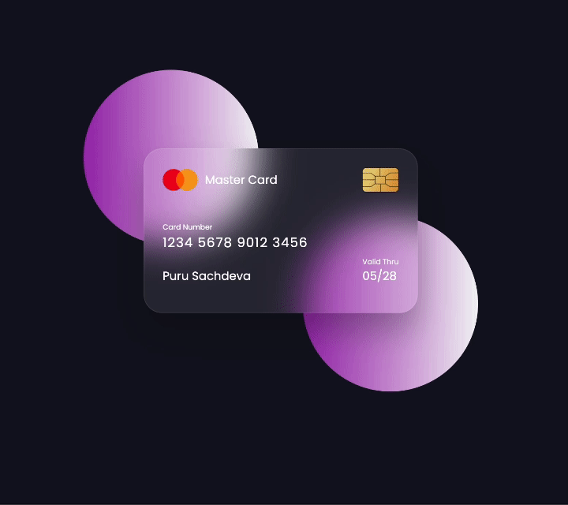

# Flipping Credit Card UI Design

This project is a simple HTML, CSS implementation of a flipping credit card UI design. 

## How to Use

1. Clone or download the repository.
2. Open the `index.html` file in your web browser.

## Video Sample

## Additional Notes

* The CSS code utilizes the `transform-style: preserve-3d;` property to enable 3D transforms for the card flip animation. This property may not be supported by all browsers.

I hope you find this project useful!
