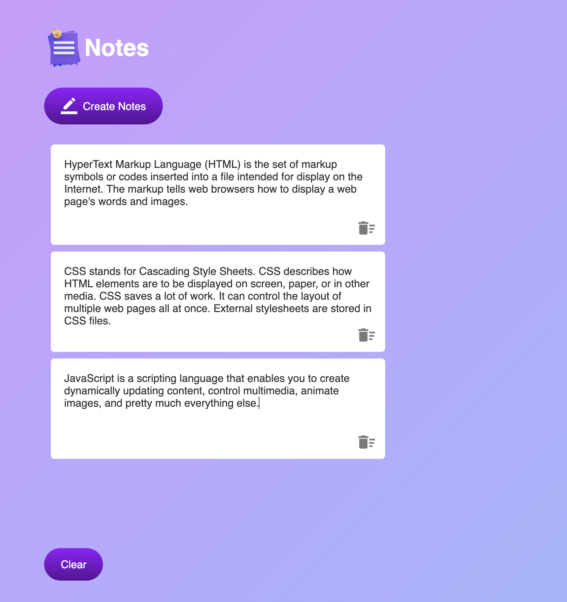

# Notes App

This is a simple Notes App project. It allows users to create, edit, and delete notes, which are then saved in the local storage of the browser.

## Features

- Create new notes
- Edit existing notes
- Delete notes
- Save notes in the local storage

## Screenshot

## Technologies Used

- HTML5
- CSS3
- JavaScript

## Usage

- To create a new note, click on the "Create Note" button.
- To edit a note, click on the note you want to edit and make the necessary changes.
- To delete a note, click on the delete button next to the note.
- All notes are automatically saved in the local storage of the browser.

## Contributing

Contributions are welcome! If you find any issues or have suggestions for improvement, please feel free to submit a pull request.